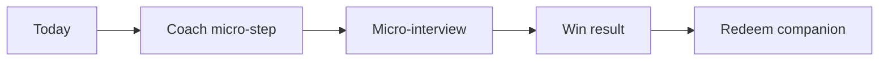

# TinyWins — Concrete 6-Hour Demo Spec

PDD Hackathon build brief for a team of 3. This document is the product
spec. If a feature is not listed under **P0 Features**, it does not ship.

**One-liner:** an emotionally supportive accountability app where an AI
coach helps you start, verifies you finished, and pays you in points you
spend on your companion.

**Target user (say this to judges):** people who know what to do but can't start.

**Scope rule:** build the demo arc below and nothing else. A narrow path
that works beats a broad app that doesn't.

---

## 0. Current repo gaps (read before coding)

The scaffold already has Today, Coach chat + timer, Rewards redeem, and a
completion **API**. The demo still breaks in the middle. Close these gaps
first; polish second.

| Gap | Why it blocks the demo | Owner |
|---|---|---|
| No completion / micro-interview UI | Judges never see AI verification | B |
| Complete route missing `newBalance`, `streakDays`, `companion`; streak never increments | Win result screen has nothing to show | A |
| Coach/Today field shapes drift from [`src/lib/contract.ts`](src/lib/contract.ts) | Integration thrash at T+3:00 | A + C |
| Points constants drift (`points.ts` vs `contract.ts`) | Wrong scores / failing tests | A |
| Missing `tests/verifier.test.ts` + documented iteration | Rubric gate (PDD evidence) | C |
| Missing prompts before next edit of `ui_coach`, `tasks_api`, `rewards_api`, `ui_rewards` | Convention / compliance score | B / A |

**Demo task (seeded):** `Clean the kitchen` (difficulty 2).  
**Seeded start state:** streak `3`, ledger balance `40`, companion level `2` / xp `80` /
`content` mood, with `lastStreakAt` set to the preceding UTC day.
**Demo redeem item:** `Tiny hat` (cost `20`).

---

## 1. The only P0 user journey (5 steps)



### Step 1 — Today
User opens `/today` and sees open tasks, streak, and points.

### Step 2 — Coach 2-minute start
User taps **I'm stuck** on `Clean the kitchen` → `/coach?taskId=…`.
Coach returns one empathetic reply + one concrete micro-step + 120s timer.
User taps **Start timer** (user gesture), timer counts down.

### Step 3 — Verification
User taps **I'm done** → fixed 2-question form (not LLM-generated):
1. What did you actually do?
2. What was the hardest part?

Submit → `POST /api/tasks/:id/complete` with `{ answers: [q1, q2] }`.

### Step 4 — Win result
Show verdict, multiplier, points awarded, new balance, streak (3 → 4).
Primary CTA: **Spend points → Rewards**.

### Step 5 — Rewards payoff
On `/rewards`, redeem **Tiny hat**. Show celebration + companion XP/level update.

Anything outside this path is cut until the T+4:30 rehearsal is flawless.

---

## 2. P0 Features (build these)

Each feature has: screens/files, interactions, state machine, API effects,
acceptance criteria, and owner.

### F1. Today — task list + stuck CTA
**Owner:** B · **Files:** [`src/app/today/page.tsx`](src/app/today/page.tsx), prompt [`prompts/ui-today_typescript.prompt`](prompts/ui-today_typescript.prompt)

**Shows**
- Header: streak days + points balance (from `GET /api/tasks`)
- List of `status: "open"` tasks (title + difficulty)
- Per task: single CTA **I'm stuck** → `/coach?taskId={id}`

**States:** `loading` → `loaded` | `error`

**Failures (labeled)**
- Fetch fails → banner: "couldn't load tasks — refresh"
- Empty open list → "nothing open today" (seed should prevent this in demo)

**Acceptance**
- [ ] Incognito `/today` shows seeded kitchen task + streak 3 + balance 40
- [ ] **I'm stuck** navigates with `taskId` query param
- [ ] No add-task UI, no complete button on Today (those are out of P0)

---

### F2. Coach — chat → Start → timer → I'm done
**Owner:** B (UI) + C (coach JSON) · **Files:** [`src/app/coach/page.tsx`](src/app/coach/page.tsx), [`src/lib/coach.ts`](src/lib/coach.ts), [`src/app/api/coach/chat/route.ts`](src/app/api/coach/chat/route.ts)  
**Prompt owed before UI edits:** `prompts/ui_coach_typescript.prompt`

**Interactions**
1. Land with `?taskId=` → auto-send exactly once per `taskId`:
   `"I'm stuck—help me start."` The API supplies the task title from
   `taskId`; use a `useRef` guard so React development mode cannot send it
   twice. This makes the demo deterministic.
2. Coach replies via `POST /api/coach/chat` with empathy + micro-step.
3. **2-minute start card** appears with description + **Start timer** button.
   - Do **not** auto-start the timer on card render (needed for TTS user-gesture later; also clearer UX).
4. After Start (or once timer has started), show **I'm done**.
5. **I'm done** transitions to F3 interview (does not call complete yet).

**Coach page states**
```
chatting → microStepReady → timing → interview → submitting → result
```

| State | UI |
|---|---|
| `chatting` | Message list + input |
| `microStepReady` | Card + **Start timer** (timer not running) |
| `timing` | Countdown + **I'm done** |
| `interview` | F3 form |
| `submitting` | Disable submit, show progress |
| `result` | F4 win card |

**Failures (labeled)**
- Coach LLM down → keep existing offline reply; never invent a silent canned pep talk
- Missing `taskId` → chat still works, but **I'm done** is hidden (completion needs an id)

**Acceptance**
- [ ] Seeded task produces a micro-step + `timerSeconds` (typically 120)
- [ ] Timer starts only on **Start timer**
- [ ] **I'm done** opens interview without waiting for 0:00 (demo speed)

**Freeze coach JSON shape (align code to contract):**
```ts
// CoachChatResponse — src/lib/contract.ts is source of truth
{
  reply: string;
  microStep?: { description: string; timerSeconds: number };
}
```
Today's flat `{ microStep: string, timerSeconds?: number }` in `coach.ts` /
coach page must be migrated to the nested shape in the same commit as the
prompt/test update.

---

### F3. Micro-interview (completion UI)
**Owner:** B · **Files:** coach page (inline panel is fine; no new route required)

**Fixed questions (hardcoded copy)**
1. What did you actually do?
2. What was the hardest part?

**Request**
```http
POST /api/tasks/{taskId}/complete
Content-Type: application/json

{ "answers": ["<q1>", "<q2>"] }
```

**Client rules**
- Both answers required, trim whitespace, min 1 non-empty char each
- On 400 → inline "answer both questions"
- On 409 (already done) → "already verified — pick another task"
- On 5xx / network → "verification offline — try again"

**Acceptance**
- [ ] Submitting two specific answers returns 200 and moves to F4
- [ ] Empty answers never hit the LLM
- [ ] Route independently validates exactly two non-empty strings after
      trimming; a direct malformed request returns 400 before the verifier

---

### F4. Win result card
**Owner:** B (UI) + A (payload) · Renders from `CompleteTaskResponse`

**Shows**
- Verdict badge: `accepted` | `partial` | `rejected`
- Verifier's one-sentence, non-judgmental explanation (`verdictMessage`)
- Multiplier (e.g. `1.5×`)
- `+{pointsAwarded} pts`
- New balance + streak days
- A P0 completion can be `accepted` or `partial`; preserve the `rejected` UI
  state for a future zero-point verifier, but do not fabricate it from a
  clamped `0.5×` response.
- If a future `rejected` / zero-point result occurs: show it honestly; CTA
  becomes **Back to Today**
- Primary CTA when points > 0: **Spend points →** `/rewards`

**Acceptance**
- [ ] After an honest kitchen completion, streak displays `4` and balance increases
- [ ] No fake celebration if the API failed

---

### F5. Complete API — real data effects
**Owner:** A · **Files:** [`src/app/api/tasks/[id]/complete/route.ts`](src/app/api/tasks/[id]/complete/route.ts), [`src/lib/points.ts`](src/lib/points.ts), [`src/lib/contract.ts`](src/lib/contract.ts)  
**Prompt owed before edits:** `prompts/tasks_api_typescript.prompt`

**On success (task was `open`)**
1. Validate `answers` is exactly two non-empty strings after trimming; otherwise
   return `400` before any database or LLM work.
2. **Before calling the verifier:** if `task.status === "done"`, return
   `409`. Do not spend an LLM call on an idempotent retry.
3. Run verifier → `{ multiplier, verifierMessage }`; clamp only to the
   supported `[0.5, 2.0]` range.
4. Map the P0 multiplier bands:
   - `1.5 <= multiplier <= 2.0` → `"accepted"`
   - `0.5 <= multiplier < 1.5` → `"partial"`
   - `"rejected"` is not emitted in P0. It requires a future verifier
     contract with multiplier `0`, not a reinterpretation of `0.5×`.
5. Determine whether this is the first qualifying completion on the current
   **UTC calendar day** from `user.lastStreakAt` *before* calculating points.
   `lastStreakAt` is required because the seeded ledger contains historical
   task points and therefore cannot identify today's first completion.
6. `calculatePoints(...)` uses the frozen economy formula below:
   `round(BASE_POINTS[difficulty] * multiplier) + (isFirstToday ? 5 : 0)`,
   capped at the remaining daily budget.
7. In one transaction: mark task `done`, write `CheckIn` with
   `verifierMessage`, write `PointsLedger`, and, if `isFirstToday`, increment
   `user.streak` and set `lastStreakAt` to now.
8. Load companion + ledger sum and return full `CompleteTaskResponse`.

**Idempotency**
- If task already `done` → `409` `{ error: "task already completed" }`

**Response (required)**
```ts
{
  verdict: "accepted" | "partial" | "rejected";
  verdictMessage: string;   // verifier's user-facing explanation
  multiplier: number;       // 0.5..2.0
  pointsAwarded: number;
  newBalance: number;
  streakDays: number;
  companion: { level: number; xp: number; mood: "content" | "proud" | "sleepy" | "worried" };
}
```

**Acceptance**
- [ ] First kitchen completion: streak 3→4, balance increases, task status `done`
- [ ] Second complete on same task → 409, no double points
- [ ] Daily cap still enforced (`DAILY_POINT_CAP = 150`)
- [ ] A seeded `lastStreakAt` from yesterday makes the first demo completion
      earn exactly one `+5` streak bonus

---

### F6. Rewards shelf + redeem celebration
**Owner:** B (UI) + A (API shape) · **Files:** [`src/app/rewards/page.tsx`](src/app/rewards/page.tsx), [`src/app/api/rewards/route.ts`](src/app/api/rewards/route.ts), [`src/app/api/rewards/[id]/redeem/route.ts`](src/app/api/rewards/[id]/redeem/route.ts)  
**Prompts owed:** `ui_rewards`, `rewards_api`

**Shows**
- Points balance
- Companion level / xp / mood
- Shelf items with cost; disable / label items user cannot afford

**States:** `idle` → `redeeming` → `celebrating` (~1.2s) → `idle`

**API**
- `GET /api/rewards` → `{ items, companion, pointsBalance }`
- `POST /api/rewards/:id/redeem` → `{ ok, newBalance, companion }`
- Insufficient points → `400` with clear error; UI shows "not enough points"

**Demo path:** redeem **Tiny hat** (20 pts) after F4.

**Seed math:** set the seeded companion to level 2 / xp 80. With the current
`XP_PER_LEVEL = 50`, Tiny hat takes it to xp 100 / level 3. The existing
xp 40 seed would only reach xp 60 and would *not* produce the promised
level-up.

**Acceptance**
- [ ] Balance visible before redeem
- [ ] Successful Tiny hat redeem changes companion level 2→3, updates balance,
      and plays celebration
- [ ] Field name is `companion` (not `companionState`)

**P0 does not require** functional theme switching or skip-token streak protection — shelf display + XP on redeem is enough.

---

### F7. Contract + economy freeze
**Owner:** A · **Source of truth:** [`src/lib/contract.ts`](src/lib/contract.ts)

Align implementations to these constants (update `points.ts` + tests; do not leave drift):

| Constant | Value |
|---|---|
| `BASE_POINTS` | `{ 1: 10, 2: 20, 3: 40 }` |
| `STREAK_BONUS` | flat `+5` only when `lastStreakAt` is before today in UTC |
| `DAILY_POINT_CAP` | `150` |
| `VERIFIER_MULTIPLIER` | `{ min: 0.5, max: 2.0 }` |

**Endpoint field names (freeze)**

| Endpoint | Must return |
|---|---|
| `GET /api/tasks` | `{ tasks, streakDays, pointsBalance, companion }` |
| `POST /api/coach/chat` | `{ reply, microStep?: { description, timerSeconds } }` |
| `POST /api/tasks/:id/complete` | `CompleteTaskResponse` above |
| `GET /api/rewards` | `{ items, companion, pointsBalance }` |
| `POST /api/rewards/:id/redeem` | `{ ok, newBalance, companion }` |

**Acceptance**
- [ ] UI types import from `contract.ts` (or match it 1:1)
- [ ] `tests/points.test.ts` and `tests/contract.test.ts` agree on the same numbers
- [ ] `CompanionState.mood` matches the existing Prisma/seed domain:
      `"content" | "proud" | "sleepy" | "worried"` (do not invent
      `"happy" | "neutral"`)
- [ ] `RewardItem.kind` matches the existing Prisma/seed domain:
      `"accessory" | "theme" | "skip-token"`; Tiny hat is `"accessory"`
- [ ] Add `User.lastStreakAt: DateTime?` via Prisma migration and seed it to
      yesterday for the demo user; backdate seed ledger rows as historical
      balance, not today's completions

---

### F8. AI reliability + PDD evidence
**Owner:** C · **Files:** [`src/lib/llm.ts`](src/lib/llm.ts), [`src/lib/coach.ts`](src/lib/coach.ts), [`src/lib/verifier.ts`](src/lib/verifier.ts), [`PDD_EVIDENCE.md`](PDD_EVIDENCE.md), [`DISCLOSURES.md`](DISCLOSURES.md)

**Must ship**
- Coach + verifier return structured JSON with retry-once via `chatJSON`
- Labeled offline fallbacks only (existing coach route pattern)
- `tests/verifier.test.ts` with 5 canned cases: 2 honest, 2 lazy, 1 gaming
- One documented prompt iteration in `PDD_EVIDENCE.md` (§ planned iteration)
- `tests/coach.test.ts` stubbing `chatJSON` for micro-step presence
- Evidence rows for any newly written prompt chains

**Acceptance**
- [ ] `npm test` includes passing verifier + coach tests
- [ ] Iteration log filled (failing case → prompt change → fix)
- [ ] Sponsor checkboxes in `DISCLOSURES.md` only checked if demos work

**Verifier test thresholds (freeze these):**

| Case | Expected multiplier | P0 outcome |
|---|---|---|
| Honest, specific (2 cases) | `>= 1.5` | `accepted` |
| Lazy / generic (2 cases) | `0.5..1.0` | `partial` |
| Gaming / unrelated (1 case) | `0.5..0.7` | `partial`, with non-accusatory message |

The verifier prompt and tests must use this table. P0 does not claim that it
can prove a lie or issue a `rejected` verdict.

---

## 3. API contract (copy for A/B/C whiteboards)

```
GET    /api/health                 → { ok: true }
GET    /api/tasks                  → TodayResponse
POST   /api/tasks                  { title, difficulty } → Task          // exists; no P0 UI
POST   /api/coach/chat             { message, taskId? } → CoachChatResponse
POST   /api/tasks/:id/complete     { answers: [string, string] } → CompleteTaskResponse
GET    /api/rewards                → RewardsResponse
POST   /api/rewards/:id/redeem     → RedeemResponse
POST   /api/tts                    { text } → audio/mpeg | 503           // P2 only
```

Types live in [`src/lib/contract.ts`](src/lib/contract.ts). Changing them requires
all three agreeing out loud, editing that file first, then updating dependents.

---

## 4. Who builds what (deliverables, not vibes)

### Person A — Platform spine
| Deliverable | Time-box | Done when |
|---|---|---|
| F5 complete route: streak, full response, 409 idempotency | T+0:30–2:00 | curl complete returns contract shape; streak persists |
| F7 align `points.ts`, Prisma/seed enum values, `lastStreakAt`, and GET tasks/rewards field names | T+2:00–3:00 | Today/Rewards can type against contract; Tiny hat levels 2→3 |
| Write `tasks_api` / `rewards_api` prompts before edits | with each change | CONVENTION row ✅ |
| Keep Render deploy green | all day | health endpoint up |
| Edge cases: daily cap, double-complete | T+3:15–4:30 | covered manually or tested |

**Does not own:** coach prompts, UI polish, demo video.

### Person B — Frontend + demo
| Deliverable | Time-box | Done when |
|---|---|---|
| F1 Today stuck CTA + error banner | T+0:30–1:30 | seeded list clickable |
| F2–F4 Coach Start → interview → result | T+1:30–3:30 | full arc without Rewards |
| F6 Rewards balance + redeem celebration | T+3:00–4:00 | Tiny hat redeem works |
| Write `ui_coach` / `ui_rewards` prompts before edits | with each change | CONVENTION row ✅ |
| 90s demo script + T+4:30 rehearsal + video | T+4:30–5:40 | recorded on deployed URL |

**Does not own:** verifier prompts, Render YAML, PDD evidence assembly.

### Person C — AI + paperwork
| Deliverable | Time-box | Done when |
|---|---|---|
| Coach nested `microStep` shape + tests | T+0:30–2:00 | contract-aligned JSON |
| Verifier reliability + `tests/verifier.test.ts` | T+0:30–3:00 | 5 cases runnable |
| Planned iteration logged in `PDD_EVIDENCE.md` | T+3:15–3:45 | v1 miss → prompt rev → v2 |
| DISCLOSURES + submission dry run | T+2:00, finalize T+5:30 | form filled |
| P2 ElevenLabs only after flawless rehearsal | after T+4:30 | optional |

**If C finishes early:** help B polish UI — never the reverse under feature freeze.

---

## 5. Hard cut list (do not build in P0)

| Idea | Status | Revisit when |
|---|---|---|
| Add-task UI | CUT | After demo arc green |
| Rescue mode / distress tone | CUT (old P1) | Never during freeze |
| Companion mood reacts to streak | CUT (old P1) | Never during freeze |
| Functional skip-token / streak shield | CUT | Display-only shelf item OK |
| Weekly recap screen | CUT (old P2) | Not today |
| ElevenLabs TTS pep talk | P2 gated | Existing code must not prefetch/call `/api/tts` until the T+4:30 gate passes |
| Real auth / multi-user | CUT | Disclosed single demo user |
| Postgres migration | CUT | SQLite ephemeral OK |
| Render Workflows daily recap / mem0 | CUT | Not required for this demo arc |

**P2 entry gate:** feature freeze rehearsal on the deployed URL passes
end-to-end with real LLM calls. The existing TTS code remains disabled (no
prefetch or `/api/tts` request) until this gate passes. Then C may enable
voice only on the **Start timer** flow: prefetch once the micro-step card
renders, play on the Start user gesture, and show `voice unavailable` for a
503. Claim ElevenLabs on the submission form only if it demonstrably plays
in the video. Disclose: voice covers the 2-minute-start card only.

---

## 6. Clock with user-visible checkpoints

| Time | Checkpoint (evidence, not hope) |
|---|---|
| T+0:00–0:30 | Freeze this doc + `contract.ts`. A confirms deploy health. C verifies LLM key (`npm run verify:minimax` or fallback). No feature thrash. |
| T+0:30–2:00 | A: F5 streak + response shape + `lastStreakAt` migration. B: F1 + Start button. C: coach shape + verifier tests scaffolding. |
| T+2:00 | **Complete UI connected locally** (interview → points on screen). C: submission form dry run. |
| T+3:00 | **Deployed end-to-end walkthrough** of steps 1–5 on Render URL. Ugly OK. Broken = only priority. |
| T+3:15–3:45 | C: verifier 5-case iteration logged. A: contract drift gone. B: polish result + rewards. |
| T+4:30 | **Feature freeze + full rehearsal.** P2 only if flawless. |
| T+4:30–5:40 | B records video. C finalizes README / PDD_EVIDENCE / DISCLOSURES. A confirms fresh clone + `npm test`. **Submit T+5:40.** |
| T+5:40–6:00 | Buffer. |

Commit early from all three accounts. No giant end-of-day dump.

---

## 7. Planned verifier iteration (do not skip)

Around T+3:30, C runs 5 canned answer pairs against `verifyCompletion`:

| # | Style | Intent |
|---|---|---|
| 1–2 | Honest, specific | Should score ≥ 1.5 (`accepted`) |
| 3–4 | Lazy / vague ("did it", "idk") | Should score 0.5–1.0 (`partial`) |
| 5 | Gaming / copy-task-title only | Should score 0.5–0.7 (`partial`, never accusatory) |

Process:
1. Record the misscored case in `PDD_EVIDENCE.md`
2. Revise `prompts/verifier_typescript.prompt`
3. Regenerate `src/lib/verifier.ts` (or `pdd --local update` after a tiny hand-fix)
4. Re-run; log v2 result

This is scheduled scoring, not optional polish.

---

## 8. 90-second demo script (3 beats)

**Pitch (≤30s, then stop talking):**  
"People who struggle emotionally don't need another to-do list; they need help starting and a reason to be honest about finishing. TinyWins' AI coach shrinks any task to a 2-minute first step, then interviews you when you claim it's done and pays points by effort, not by tap. Points level up your companion."

| Beat | ≤30s actions |
|---|---|
| 1. Stuck | Today → Clean the kitchen → I'm stuck → coach offers micro-step → Start timer |
| 2. Verified win | I'm done → answer two specific questions → show verdict message + multiplier + points + streak 3→4 |
| 3. Payoff | Rewards → redeem Tiny hat → companion level 2→3 celebration |

Let judges tap. Do not narrate over the UI.

---

## 9. Rehearsal checklist (T+4:30)

Run on the **deployed** URL in an incognito window:

- [ ] `/today` loads seeded tasks, streak, points (no console errors)
- [ ] I'm stuck → coach returns real LLM micro-step (not offline fallback)
- [ ] Start timer → countdown visible
- [ ] I'm done → interview → complete succeeds
- [ ] Win card shows verdict message, multiplier, points, streak 4, new balance
- [ ] Redeem Tiny hat → level 2→3 celebration + companion update
- [ ] Refresh Today: kitchen task no longer open / status done
- [ ] Kill LLM key briefly → labeled offline, not a silent fake
- [ ] `npm test` green locally
- [ ] `DISCLOSURES.md` accurate; sponsor tracks only if working
- [ ] Video captures beats 1–3 without cuts that hide failures

**Definition of done:** one fresh/incognito walkthrough of the 3-beat script with real endpoints and real LLM calls; `npm test` green; no unlabeled mocks; PDD verifier chain present (prompt → module → complete route → test) with iteration log filled.

---

## 10. Rubric mapping (why this scope)

| Criterion | Pts | How this spec scores |
|---|---|---|
| PDD Method & Traceability | 25 | Prompt per module; verifier iteration scheduled; evidence rows |
| Technical Execution | 25 | One narrow deployed path; real LLM; Render kept green |
| Problem Fit & User Value | 20 | Stuck-not-lazy user; start + verify wedge |
| Innovation & Learning | 15 | AI-verified completion + documented prompt revision |
| Demo & Communication | 15 | 3×30s beats; honest disclosures |

Tiebreakers: automated PDD compliance, then earlier submit → target **T+5:40**.

---

## 11. Risks (operational)

| Risk | Mitigation |
|---|---|
| LLM flakes in demo | Low temperature, JSON retry-once, labeled offline fallback |
| Merge conflicts | Module ownership above; contract freeze; trunk-based small commits |
| Contract drift mid-build | Edit `contract.ts` first; A owns field rename PRs |
| C crushed at the end | Evidence continuous; B owns video alone |
| "Isn't this Habitica?" | Habitica trusts a tap; TinyWins interviews you and helps you start |

---

## 12. Submission gates (six)

1. Team of 3 registered  
2. Submit by deadline (target T+5:40)  
3. Judges can open repo, deployed URL, video (incognito-tested)  
4. Version history shows today's work from all three; pre-work disclosed  
5. At least one full PDD chain: `verifier` prompt → `src/lib/verifier.ts` → complete route → `tests/verifier.test.ts`  
6. `DISCLOSURES.md`: no real auth, SQLite resets, verifier is plausibility not proof, mocked states, borrowed vs built, sponsor tracks only if shown working  

README must cover: problem, user, setup, architecture, run/test, what was built today, limitations.
